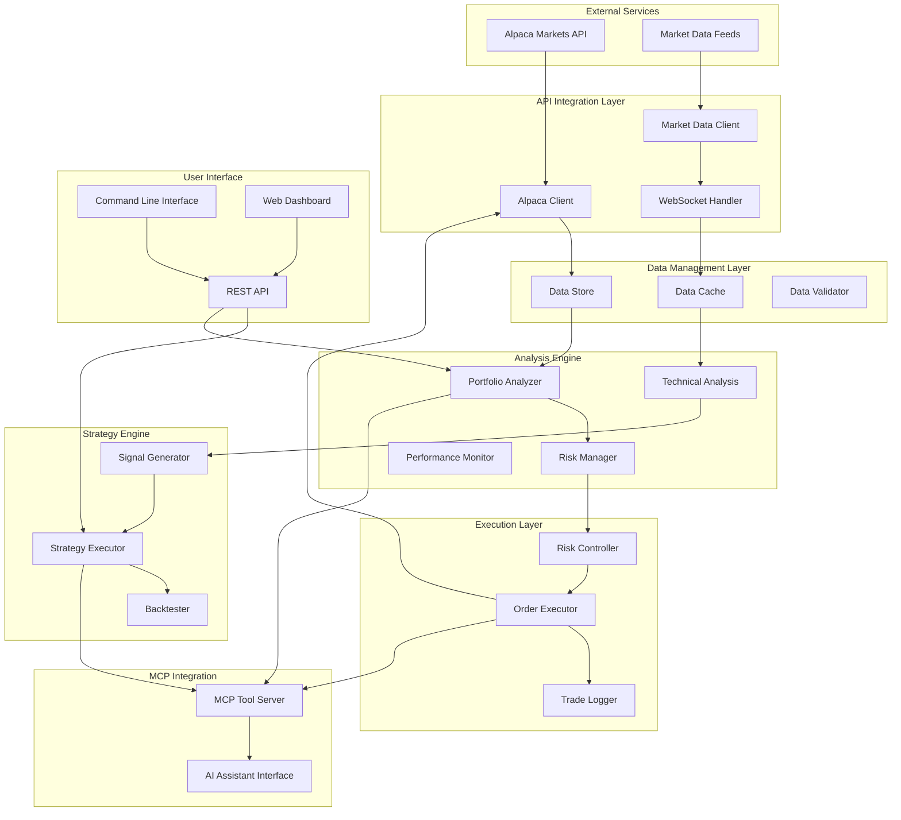

# Design Document

## Overview

The Financial Portfolio Automation Framework is a comprehensive system that integrates with Alpaca Markets to provide intelligent portfolio management, automated trading, and real-time analysis capabilities. The system follows a modular architecture with clear separation of concerns, enabling scalable and maintainable financial automation.

The framework consists of five core layers:
1. **API Integration Layer** - Handles all external API communications
2. **Data Management Layer** - Manages market data storage and retrieval
3. **Analysis Engine** - Performs portfolio analysis and generates insights
4. **Strategy Engine** - Implements trading strategies and decision logic
5. **Execution Layer** - Handles trade execution and risk management

## Architecture



## Components and Interfaces

### API Integration Layer

#### Alpaca Client
- **Purpose**: Primary interface to Alpaca Markets API
- **Responsibilities**:
  - Authentication and session management
  - Account information retrieval
  - Order placement and management
  - Position and portfolio data access
- **Key Methods**:
  - `authenticate(api_key, secret_key, environment)`
  - `get_account_info()`
  - `get_positions()`
  - `place_order(symbol, qty, side, order_type, time_in_force)`
  - `cancel_order(order_id)`

#### Market Data Client
- **Purpose**: Handles real-time and historical market data
- **Responsibilities**:
  - Real-time quote and trade data streaming
  - Historical data retrieval
  - Market calendar and trading hours
  - Options chain data
- **Key Methods**:
  - `subscribe_quotes(symbols)`
  - `subscribe_trades(symbols)`
  - `get_historical_data(symbol, timeframe, start, end)`
  - `get_options_chain(symbol, expiration)`

#### WebSocket Handler
- **Purpose**: Manages real-time data streaming connections
- **Responsibilities**:
  - Connection lifecycle management
  - Message parsing and routing
  - Reconnection logic
  - Data quality validation
- **Key Methods**:
  - `connect()`
  - `subscribe(channels, symbols)`
  - `handle_message(message)`
  - `reconnect()`

### Data Management Layer

#### Data Store
- **Purpose**: Persistent storage for market data and portfolio history
- **Technology**: SQLite for local storage, with PostgreSQL option for production
- **Schema Design**:
  - `quotes` table: symbol, timestamp, bid, ask, bid_size, ask_size
  - `trades` table: symbol, timestamp, price, size, conditions
  - `positions` table: symbol, qty, market_value, cost_basis, unrealized_pnl
  - `orders` table: order_id, symbol, qty, side, order_type, status, filled_qty
  - `portfolio_snapshots` table: timestamp, total_value, buying_power, day_pnl

#### Data Cache
- **Purpose**: In-memory caching for frequently accessed data
- **Technology**: Redis-compatible interface with fallback to in-memory dict
- **Caching Strategy**:
  - Real-time quotes: 1-second TTL
  - Account data: 30-second TTL
  - Historical data: 1-hour TTL
  - Technical indicators: 5-minute TTL

#### Data Validator
- **Purpose**: Ensures data quality and consistency
- **Validation Rules**:
  - Price data within reasonable bounds
  - Timestamp consistency and ordering
  - Symbol format validation
  - Quantity and monetary value constraints

### Analysis Engine

#### Technical Analysis Module
- **Purpose**: Calculates technical indicators and chart patterns
- **Indicators Supported**:
  - Moving Averages (SMA, EMA, WMA)
  - Momentum indicators (RSI, MACD, Stochastic)
  - Volatility indicators (Bollinger Bands, ATR)
  - Volume indicators (OBV, VWAP)
- **Implementation**: Custom calculations with NumPy/Pandas optimization

#### Portfolio Analyzer
- **Purpose**: Comprehensive portfolio analysis and metrics calculation
- **Metrics Calculated**:
  - Portfolio value and allocation
  - Risk metrics (Beta, VaR, Sharpe ratio)
  - Performance attribution
  - Correlation analysis
  - Drawdown analysis
- **Key Methods**:
  - `calculate_portfolio_metrics(positions, market_data)`
  - `analyze_risk_exposure(positions, benchmark)`
  - `generate_performance_report(start_date, end_date)`

#### Risk Manager
- **Purpose**: Monitors and controls portfolio risk exposure
- **Risk Controls**:
  - Position size limits (per symbol and sector)
  - Portfolio concentration limits
  - Maximum drawdown thresholds
  - Volatility-based position sizing
- **Key Methods**:
  - `validate_order_risk(order, current_positions)`
  - `calculate_position_size(signal_strength, volatility, risk_budget)`
  - `monitor_portfolio_risk(positions, market_data)`

### Strategy Engine

#### Strategy Executor
- **Purpose**: Implements and executes trading strategies
- **Strategy Types**:
  - Momentum strategies (trend following, breakout)
  - Mean reversion strategies
  - Pairs trading
  - Options strategies (covered calls, protective puts)
- **Key Methods**:
  - `register_strategy(strategy_config)`
  - `execute_strategy(strategy_id, market_data)`
  - `get_strategy_signals(strategy_id)`

#### Backtester
- **Purpose**: Historical strategy performance testing
- **Features**:
  - Walk-forward analysis
  - Monte Carlo simulation
  - Transaction cost modeling
  - Slippage and market impact estimation
- **Key Methods**:
  - `run_backtest(strategy, start_date, end_date, initial_capital)`
  - `calculate_performance_metrics(backtest_results)`
  - `generate_backtest_report(backtest_id)`

### Execution Layer

#### Order Executor
- **Purpose**: Handles trade execution with intelligent order routing
- **Order Types Supported**:
  - Market orders
  - Limit orders
  - Stop-loss orders
  - Bracket orders (OCO)
- **Features**:
  - Smart order routing
  - Partial fill handling
  - Order status monitoring
- **Key Methods**:
  - `execute_order(order_request)`
  - `monitor_order_status(order_id)`
  - `handle_partial_fill(order_id, fill_data)`

#### Risk Controller
- **Purpose**: Pre-trade and post-trade risk validation
- **Controls**:
  - Pre-trade risk checks
  - Real-time position monitoring
  - Automatic stop-loss execution
  - Portfolio rebalancing triggers
- **Key Methods**:
  - `validate_pre_trade_risk(order)`
  - `monitor_position_risk(symbol, current_price)`
  - `execute_risk_management_action(action_type, parameters)`

### MCP Integration

#### MCP Tool Server
- **Purpose**: Provides AI assistant access to portfolio management functions
- **Exposed Functions**:
  - Portfolio analysis and reporting
  - Market data retrieval and analysis
  - Strategy backtesting and optimization
  - Trade execution and monitoring
- **Security**: Role-based access control with configurable permissions

## Data Models

### Core Data Structures

```python
@dataclass
class Quote:
    symbol: str
    timestamp: datetime
    bid: Decimal
    ask: Decimal
    bid_size: int
    ask_size: int

@dataclass
class Position:
    symbol: str
    quantity: int
    market_value: Decimal
    cost_basis: Decimal
    unrealized_pnl: Decimal
    day_pnl: Decimal

@dataclass
class Order:
    order_id: str
    symbol: str
    quantity: int
    side: OrderSide  # BUY, SELL
    order_type: OrderType  # MARKET, LIMIT, STOP
    status: OrderStatus  # NEW, FILLED, CANCELLED
    filled_quantity: int
    average_fill_price: Optional[Decimal]

@dataclass
class PortfolioSnapshot:
    timestamp: datetime
    total_value: Decimal
    buying_power: Decimal
    day_pnl: Decimal
    total_pnl: Decimal
    positions: List[Position]

@dataclass
class TradingStrategy:
    strategy_id: str
    name: str
    description: str
    parameters: Dict[str, Any]
    risk_limits: RiskLimits
    is_active: bool
```

### Configuration Models

```python
@dataclass
class AlpacaConfig:
    api_key: str
    secret_key: str
    base_url: str  # paper or live trading
    data_feed: str  # IEX, SIP, etc.

@dataclass
class RiskLimits:
    max_position_size: Decimal
    max_portfolio_concentration: float
    max_daily_loss: Decimal
    max_drawdown: float
    stop_loss_percentage: float

@dataclass
class StrategyConfig:
    strategy_type: str
    parameters: Dict[str, Any]
    symbols: List[str]
    risk_limits: RiskLimits
    execution_schedule: str
```

## Error Handling

### Error Categories

1. **API Errors**
   - Authentication failures
   - Rate limiting
   - Network connectivity issues
   - Invalid requests

2. **Data Errors**
   - Missing or corrupted market data
   - Stale data detection
   - Data validation failures

3. **Trading Errors**
   - Insufficient buying power
   - Invalid order parameters
   - Market closed errors
   - Position limits exceeded

4. **System Errors**
   - Database connection failures
   - Configuration errors
   - Memory/resource constraints

### Error Handling Strategy

```python
class PortfolioAutomationError(Exception):
    """Base exception for portfolio automation system"""
    pass

class APIError(PortfolioAutomationError):
    """API-related errors"""
    def __init__(self, message: str, status_code: int = None, retry_after: int = None):
        super().__init__(message)
        self.status_code = status_code
        self.retry_after = retry_after

class DataError(PortfolioAutomationError):
    """Data quality or availability errors"""
    pass

class TradingError(PortfolioAutomationError):
    """Trading execution errors"""
    pass

class RiskError(PortfolioAutomationError):
    """Risk management violations"""
    pass
```

### Retry Logic

- **Exponential Backoff**: For transient API errors
- **Circuit Breaker**: For persistent service failures
- **Graceful Degradation**: Use cached data when real-time data unavailable
- **Error Notifications**: Alert users of critical system errors

## Testing Strategy

### Unit Testing
- **Coverage Target**: 90% code coverage
- **Mock External Dependencies**: Alpaca API, market data feeds
- **Test Data**: Synthetic market data for consistent testing
- **Key Test Areas**:
  - Technical indicator calculations
  - Risk metric computations
  - Order validation logic
  - Strategy signal generation

### Integration Testing
- **Paper Trading Environment**: Use Alpaca's paper trading for safe integration testing
- **End-to-End Workflows**: Complete trading scenarios from signal to execution
- **Data Pipeline Testing**: Market data ingestion and processing
- **MCP Tool Testing**: AI assistant integration scenarios

### Performance Testing
- **Load Testing**: High-frequency data processing
- **Latency Testing**: Order execution speed
- **Memory Testing**: Long-running analysis processes
- **Stress Testing**: Market volatility scenarios

### Backtesting Validation
- **Historical Accuracy**: Verify backtest results against known benchmarks
- **Look-Ahead Bias**: Ensure no future data leakage
- **Survivorship Bias**: Include delisted securities in historical tests
- **Transaction Costs**: Realistic cost modeling

### Security Testing
- **API Key Management**: Secure credential storage and rotation
- **Input Validation**: SQL injection and parameter tampering prevention
- **Access Control**: MCP tool permission validation
- **Audit Logging**: Complete transaction and access logging