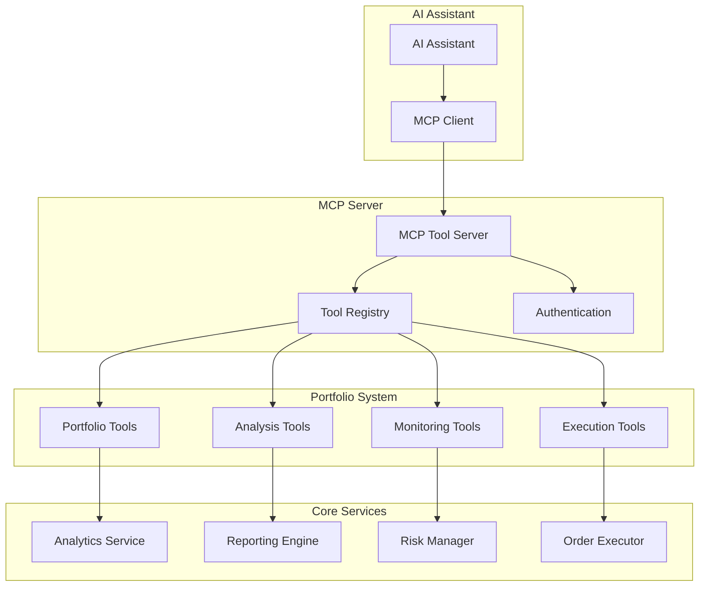
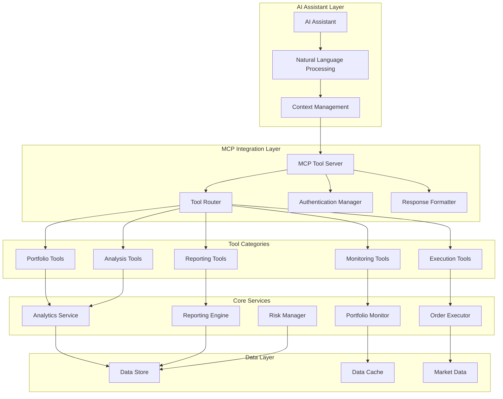

# Task 10 Handoff: Create MCP Tool Integration for AI Assistant Access

## Overview
Task 10 focuses on creating Model Context Protocol (MCP) tool integration that provides AI assistants with direct access to the comprehensive portfolio management system built in previous tasks. This integration will enable AI assistants to perform real-time portfolio analysis, execute trades with safety controls, and provide intelligent investment assistance through natural language interactions.

## Completed Foundation (Task 9)
The reporting and analytics system has been successfully implemented, providing:

### Comprehensive Reporting Infrastructure
- **ReportGenerator**: Unified interface for multi-format report generation (PDF, HTML, CSV, JSON, Excel)
- **PerformanceReport**: Complete portfolio performance analysis with 15+ risk-adjusted metrics
- **TaxReport**: Automated tax reporting with wash sale detection and Form 8949 preparation
- **TransactionReport**: Detailed transaction analysis with execution quality metrics
- **ExportManager**: Multi-format export capabilities with template support

### Real-time Analytics Engine
- **AnalyticsService**: High-performance analytics coordination with sub-second refresh rates
- **MetricsCalculator**: Real-time portfolio metrics with performance and risk analysis
- **TrendAnalyzer**: Historical trend analysis with seasonal patterns and growth phase detection
- **DataAggregator**: Multi-timeframe data aggregation (hourly, daily, weekly, monthly)
- **DashboardSerializer**: Web-optimized JSON serialization for dashboard consumption

### Integration Points Available
- **Complete Portfolio Analysis**: Performance metrics, risk analysis, and allocation breakdown
- **Real-time Market Monitoring**: Live portfolio tracking with alert integration
- **Historical Analysis**: Trend identification, volatility analysis, and drawdown periods
- **Tax Compliance Tools**: Automated tax reporting and optimization capabilities
- **Multi-format Reporting**: Comprehensive report generation for all analysis types

## Task 10 Requirements

### 10.1 MCP Server with Portfolio Management Functions
- **Requirement 9.1**: Provide direct access to all Alpaca Markets API functions
- **Requirement 9.2**: Enable real-time data retrieval and analysis
- **Requirement 9.3**: Allow programmatic portfolio analysis execution

### 10.2 MCP Trade Execution and Monitoring Tools
- **Requirement 9.4**: Allow AI assistants to place orders and manage positions programmatically
- **Requirement 9.5**: Support iterative testing and optimization based on user requests

## Implementation Plan

### Subtask 10.1: Implement MCP Server with Portfolio Management Functions

**Files to Create:**
- `financial_portfolio_automation/mcp/` (new module)
- `financial_portfolio_automation/mcp/__init__.py`
- `financial_portfolio_automation/mcp/mcp_server.py`
- `financial_portfolio_automation/mcp/portfolio_tools.py`
- `financial_portfolio_automation/mcp/analysis_tools.py`
- `financial_portfolio_automation/mcp/market_data_tools.py`
- `financial_portfolio_automation/mcp/reporting_tools.py`
- `financial_portfolio_automation/mcp/strategy_tools.py`
- `tests/test_mcp_server.py`
- `tests/test_portfolio_tools.py`
- `tests/test_analysis_tools.py`
- `tests/integration/test_mcp_integration.py`

**Key Components:**

1. **MCPToolServer Class**
   - MCP protocol implementation with tool registration
   - Authentication and session management
   - Error handling and response formatting
   - Tool discovery and capability advertisement

2. **Portfolio Management Tools**
   - `get_portfolio_summary`: Current portfolio value, positions, and allocation
   - `get_portfolio_performance`: Performance metrics with customizable periods
   - `analyze_portfolio_risk`: Risk metrics including VaR, concentration, and volatility
   - `get_asset_allocation`: Detailed position breakdown with sector analysis
   - `calculate_portfolio_metrics`: Comprehensive metrics calculation

3. **Market Data Analysis Tools**
   - `get_market_data`: Real-time and historical market data retrieval
   - `analyze_technical_indicators`: Technical analysis with customizable indicators
   - `get_market_trends`: Trend analysis and pattern recognition
   - `compare_with_benchmark`: Portfolio vs benchmark performance comparison
   - `get_sector_analysis`: Sector performance and allocation analysis

4. **Reporting and Analytics Tools**
   - `generate_performance_report`: Multi-format performance report generation
   - `generate_tax_report`: Tax analysis with wash sale detection
   - `generate_transaction_report`: Transaction history and execution analysis
   - `get_dashboard_data`: Real-time dashboard data for AI consumption
   - `export_portfolio_data`: Data export in various formats

5. **Strategy Analysis Tools**
   - `backtest_strategy`: Strategy backtesting with historical data
   - `analyze_strategy_performance`: Strategy performance attribution
   - `optimize_strategy_parameters`: Parameter optimization using historical data
   - `compare_strategies`: Multi-strategy performance comparison
   - `get_strategy_recommendations`: AI-driven strategy suggestions

### Subtask 10.2: Implement MCP Trade Execution and Monitoring Tools

**Files to Create:**
- `financial_portfolio_automation/mcp/execution_tools.py`
- `financial_portfolio_automation/mcp/monitoring_tools.py`
- `financial_portfolio_automation/mcp/risk_tools.py`
- `financial_portfolio_automation/mcp/optimization_tools.py`
- `tests/test_execution_tools.py`
- `tests/test_monitoring_tools.py`
- `tests/test_risk_tools.py`
- `tests/integration/test_mcp_execution_integration.py`

**Key Components:**

1. **Trade Execution Tools**
   - `place_order`: Order placement with comprehensive validation
   - `cancel_order`: Order cancellation with status tracking
   - `modify_order`: Order modification with risk validation
   - `get_order_status`: Real-time order status and fill information
   - `execute_strategy`: Automated strategy execution with safety controls

2. **Portfolio Monitoring Tools**
   - `monitor_portfolio`: Real-time portfolio monitoring with alerts
   - `get_position_alerts`: Position-specific alert management
   - `track_performance`: Continuous performance tracking
   - `monitor_risk_metrics`: Real-time risk monitoring and thresholds
   - `get_market_alerts`: Market-wide alert and volatility monitoring

3. **Risk Management Tools**
   - `validate_trade_risk`: Pre-trade risk validation
   - `calculate_position_size`: Optimal position sizing based on risk parameters
   - `check_risk_limits`: Portfolio-wide risk limit validation
   - `suggest_risk_adjustments`: AI-driven risk management suggestions
   - `implement_stop_losses`: Automated stop-loss implementation

4. **Strategy Optimization Tools**
   - `optimize_portfolio`: Portfolio optimization based on current market conditions
   - `rebalance_portfolio`: Automated portfolio rebalancing
   - `refine_strategy`: Iterative strategy refinement based on performance
   - `test_strategy_variations`: A/B testing of strategy modifications
   - `implement_strategy_updates`: Live strategy parameter updates

## Technical Architecture

### MCP Protocol Integration

### Tool Categories and Functions

#### Portfolio Management Tools
- **Real-time Data Access**: Live portfolio values, positions, and market data
- **Performance Analysis**: Comprehensive performance metrics and attribution
- **Risk Assessment**: Multi-dimensional risk analysis and monitoring
- **Allocation Analysis**: Detailed position and sector breakdown

#### Market Analysis Tools
- **Technical Analysis**: 20+ technical indicators with customizable parameters
- **Trend Analysis**: Automated trend identification and pattern recognition
- **Benchmark Comparison**: Performance comparison with market indices
- **Sector Analysis**: Sector rotation and performance analysis

#### Reporting Tools
- **Multi-format Reports**: PDF, HTML, CSV, JSON, and Excel export
- **Tax Reporting**: Automated tax analysis with regulatory compliance
- **Transaction Analysis**: Detailed execution quality and cost analysis
- **Dashboard Data**: Real-time data optimized for AI consumption

#### Execution Tools
- **Order Management**: Complete order lifecycle management
- **Risk Validation**: Pre-trade risk checks and position sizing
- **Strategy Execution**: Automated strategy implementation
- **Safety Controls**: Multi-layered safety mechanisms and circuit breakers

#### Monitoring Tools
- **Real-time Alerts**: Configurable alert system with multiple delivery methods
- **Performance Tracking**: Continuous performance monitoring and attribution
- **Risk Monitoring**: Real-time risk metric tracking and threshold management
- **Market Monitoring**: Market-wide volatility and event monitoring

## Integration Points

### With Existing Systems
1. **Analytics Service Integration**
   - Real-time metrics calculation for AI consumption
   - Historical trend analysis and pattern recognition
   - Performance attribution and risk analysis
   - Dashboard data serialization for AI tools

2. **Reporting Engine Integration**
   - On-demand report generation through AI commands
   - Multi-format export capabilities
   - Tax reporting and compliance analysis
   - Transaction history and execution analysis

3. **Order Execution Integration**
   - AI-driven trade execution with safety controls
   - Real-time order status and fill monitoring
   - Risk validation and position sizing
   - Strategy execution and optimization

4. **Monitoring System Integration**
   - Real-time alert generation and delivery
   - Portfolio monitoring and threshold management
   - Market volatility analysis and warnings
   - Risk metric tracking and reporting

### AI Assistant Capabilities
1. **Natural Language Portfolio Analysis**
   - "Show me my portfolio performance for the last quarter"
   - "What's my current risk exposure by sector?"
   - "Generate a tax report for 2024"
   - "How is my momentum strategy performing?"

2. **Intelligent Trade Execution**
   - "Buy $10,000 worth of AAPL with appropriate risk controls"
   - "Rebalance my portfolio to target allocation"
   - "Implement a stop-loss on my TSLA position"
   - "Execute my mean reversion strategy"

3. **Real-time Monitoring and Alerts**
   - "Alert me if my portfolio drops more than 5%"
   - "Monitor NVDA for technical breakout signals"
   - "Track my portfolio's beta relative to SPY"
   - "Notify me of any risk limit breaches"

4. **Strategy Optimization**
   - "Backtest my strategy with different parameters"
   - "Optimize my portfolio for better risk-adjusted returns"
   - "Compare my performance to the S&P 500"
   - "Suggest improvements to my current allocation"

## Security and Safety Considerations

### Authentication and Authorization
- API key management and secure storage
- Session-based authentication for MCP connections
- Role-based access control for different tool categories
- Audit logging for all AI assistant actions

### Risk Management
- Multi-layered risk validation for all trade execution
- Position size limits and portfolio concentration controls
- Real-time risk monitoring with automatic circuit breakers
- Comprehensive pre-trade risk assessment

### Data Security
- Encrypted communication between AI assistant and MCP server
- Secure handling of sensitive financial data
- Audit trails for all data access and modifications
- Compliance with financial data protection regulations

### Error Handling
- Comprehensive error handling with detailed error messages
- Graceful degradation when services are unavailable
- Automatic retry mechanisms with exponential backoff
- Clear error reporting to AI assistants for user communication

## Testing Strategy

### Unit Testing
- Individual MCP tool function testing
- Mock integration with portfolio system components
- Error handling and edge case validation
- Performance testing for real-time operations

### Integration Testing
- End-to-end MCP protocol communication
- AI assistant interaction scenarios
- Real-time data flow validation
- Multi-tool workflow testing

### Safety Testing
- Risk control validation under various market conditions
- Circuit breaker testing with simulated market stress
- Authentication and authorization testing
- Data security and privacy validation

## Performance Requirements

### Response Times
- Portfolio data retrieval: < 500ms
- Real-time market data: < 200ms
- Report generation: < 5 seconds for standard reports
- Trade execution validation: < 100ms

### Scalability
- Support for multiple concurrent AI assistant sessions
- Efficient caching for frequently accessed data
- Optimized database queries for historical analysis
- Horizontal scaling capability for high-volume usage

### Reliability
- 99.9% uptime for critical portfolio functions
- Automatic failover for market data sources
- Robust error recovery and retry mechanisms
- Comprehensive monitoring and alerting

## Dependencies and Prerequisites

### Internal Dependencies
- **Task 9**: Complete reporting and analytics system (completed)
- **Task 8**: Monitoring and alerting infrastructure
- **Task 7**: Order execution and risk control system
- **Task 5**: Portfolio and technical analysis engines
- **Task 3**: Alpaca Markets API integration

### External Dependencies
- **MCP Protocol Library**: Python MCP server implementation
- **Authentication System**: Secure API key and session management
- **WebSocket Support**: Real-time data streaming capabilities
- **JSON Schema Validation**: Tool parameter validation

### Configuration Requirements
- MCP server configuration and port settings
- Tool registration and capability advertisement
- Authentication and authorization settings
- Rate limiting and throttling configurations

## Success Criteria

### Functional Requirements
- Complete MCP tool suite covering all portfolio management functions
- Real-time AI assistant access to portfolio data and analysis
- Safe and controlled trade execution through AI commands
- Comprehensive monitoring and alerting integration

### Performance Requirements
- Sub-second response times for real-time data requests
- Support for 10+ concurrent AI assistant sessions
- 99.9% uptime for critical portfolio functions
- Efficient resource utilization and memory management

### Quality Requirements
- Comprehensive error handling with clear user feedback
- Robust security with multi-layered authentication
- Complete audit trails for all AI assistant actions
- Extensive testing coverage including safety scenarios

## Next Steps After Task 10

Task 10 completion will enable:
- **Task 11**: CLI and API endpoints with MCP tool integration
- **Task 12**: End-to-end system validation with AI assistant workflows
- **Production Deployment**: Full AI assistant integration with portfolio management

The MCP tool integration will provide the foundation for intelligent portfolio management through natural language interactions, enabling AI assistants to perform complex financial analysis, execute trades safely, and provide real-time investment assistance to users.

## Data Flow Architecture

This architecture ensures efficient data flow from AI assistant natural language requests through the MCP tool integration layer to the comprehensive portfolio management system, providing real-time access to all portfolio analysis, execution, and monitoring capabilities.