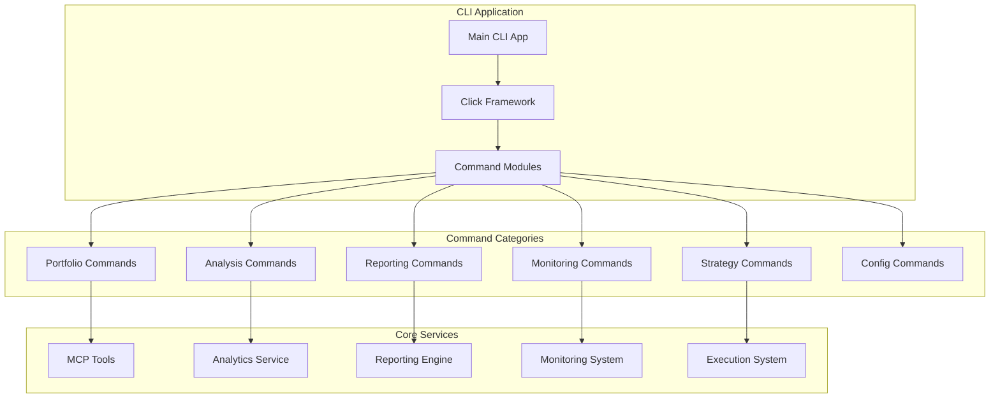
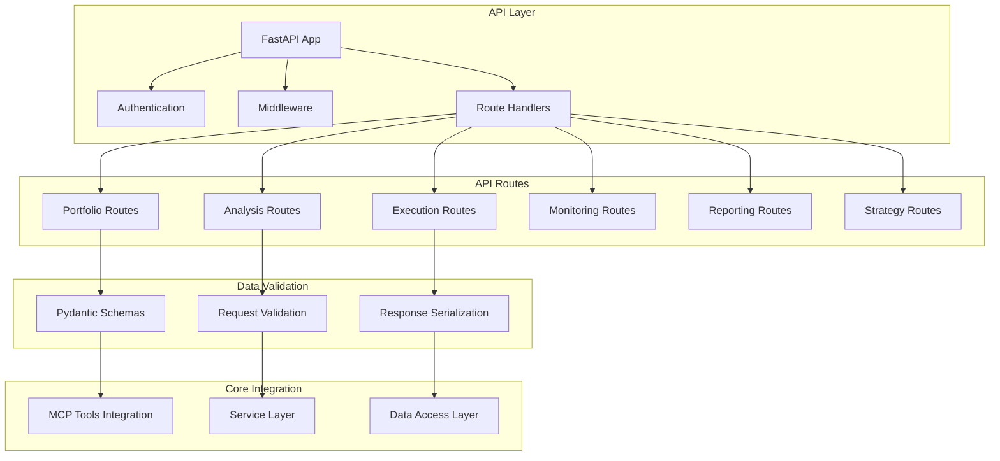
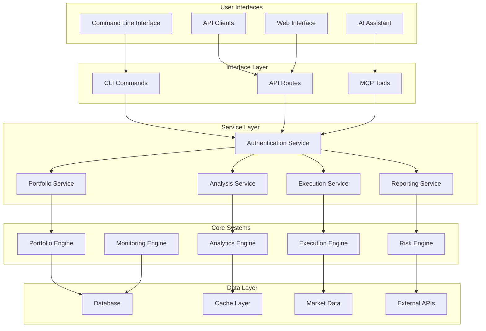

# Task 11 Handoff: Create Command-Line Interface and API Endpoints

## Overview
Task 11 focuses on creating user-facing interfaces for the comprehensive portfolio management system. This includes building a command-line interface (CLI) for system management and a REST API for external access, providing multiple ways for users to interact with the portfolio automation system beyond the MCP integration.

## Completed Foundation (Task 10)
The MCP tool integration has been successfully implemented, providing:

### Comprehensive MCP Tool Suite
- **ExecutionTools**: Complete trade execution with safety controls and risk validation
- **MonitoringTools**: Real-time portfolio monitoring with customizable alerts and performance tracking
- **RiskTools**: Advanced risk assessment with stress testing and scenario analysis
- **OptimizationTools**: Portfolio optimization with multiple objectives and constraint handling
- **PortfolioTools**: Portfolio analysis and data retrieval capabilities
- **AnalysisTools**: Technical analysis and market data tools
- **ReportingTools**: Multi-format report generation and analytics
- **StrategyTools**: Strategy backtesting and optimization capabilities
- **MarketDataTools**: Real-time and historical market data access

### AI Assistant Integration
- **Natural Language Interface**: AI assistants can interact with the portfolio system using natural language
- **Safety Controls**: Multi-layered risk validation for all AI-driven operations
- **Real-time Monitoring**: Continuous portfolio monitoring with intelligent alerting
- **Strategy Execution**: AI-driven strategy implementation with comprehensive safety mechanisms

### Integration Points Available
- **Complete Portfolio Management**: All portfolio functions accessible through MCP tools
- **Risk Management**: Advanced risk controls and validation for all operations
- **Real-time Data**: Live market data and portfolio monitoring capabilities
- **Reporting System**: Comprehensive reporting and analytics integration

## Task 11 Requirements

### 11.1 CLI for System Management
- **Requirement 7.2**: Enable portfolio analysis and reporting through command-line interface
- **Requirement 6.4**: Support strategy management and backtesting via CLI commands

### 11.2 REST API for External Access
- **Requirement 3.4**: Provide external API access to portfolio data and analysis
- **Requirement 8.2**: Enable external systems to access monitoring and alerting capabilities

## Implementation Plan

### Subtask 11.1: Implement CLI for System Management

**Files to Create:**
- `financial_portfolio_automation/cli/` (new module)
- `financial_portfolio_automation/cli/__init__.py`
- `financial_portfolio_automation/cli/main.py`
- `financial_portfolio_automation/cli/portfolio_commands.py`
- `financial_portfolio_automation/cli/analysis_commands.py`
- `financial_portfolio_automation/cli/strategy_commands.py`
- `financial_portfolio_automation/cli/reporting_commands.py`
- `financial_portfolio_automation/cli/monitoring_commands.py`
- `financial_portfolio_automation/cli/config_commands.py`
- `financial_portfolio_automation/cli/utils.py`
- `tests/test_cli_main.py`
- `tests/test_portfolio_commands.py`
- `tests/test_analysis_commands.py`
- `tests/integration/test_cli_integration.py`
- `setup.py` (update for CLI entry point)

**Key Components:**

1. **Main CLI Application**
   - Click-based command structure with subcommands
   - Configuration management and environment setup
   - Global options for output format, verbosity, and authentication
   - Error handling and user-friendly error messages
   - Progress indicators for long-running operations

2. **Portfolio Management Commands**
   - `portfolio status` - Current portfolio overview and positions
   - `portfolio positions` - Detailed position information with filtering
   - `portfolio performance` - Performance metrics and attribution analysis
   - `portfolio allocation` - Asset allocation breakdown and analysis
   - `portfolio rebalance` - Generate and execute rebalancing recommendations

3. **Analysis Commands**
   - `analyze risk` - Comprehensive portfolio risk assessment
   - `analyze performance` - Performance analysis with benchmarking
   - `analyze technical` - Technical analysis for individual securities
   - `analyze correlation` - Correlation analysis and diversification metrics
   - `analyze attribution` - Performance attribution analysis

4. **Strategy Commands**
   - `strategy list` - List available strategies and their configurations
   - `strategy backtest` - Run strategy backtests with customizable parameters
   - `strategy optimize` - Optimize strategy parameters using historical data
   - `strategy execute` - Execute strategies with safety controls
   - `strategy status` - Monitor running strategy executions

5. **Reporting Commands**
   - `report generate` - Generate various report types (performance, tax, transaction)
   - `report export` - Export portfolio data in multiple formats
   - `report schedule` - Schedule automated report generation
   - `report templates` - Manage custom report templates

6. **Monitoring Commands**
   - `monitor start` - Start real-time portfolio monitoring
   - `monitor alerts` - View and manage portfolio alerts
   - `monitor risk` - Real-time risk monitoring and threshold management
   - `monitor performance` - Continuous performance tracking

7. **Configuration Commands**
   - `config init` - Initialize system configuration
   - `config show` - Display current configuration
   - `config set` - Update configuration parameters
   - `config validate` - Validate configuration and connectivity

### Subtask 11.2: Implement REST API for External Access

**Files to Create:**
- `financial_portfolio_automation/api/` (new module for REST API)
- `financial_portfolio_automation/api/__init__.py`
- `financial_portfolio_automation/api/app.py`
- `financial_portfolio_automation/api/auth.py`
- `financial_portfolio_automation/api/middleware.py`
- `financial_portfolio_automation/api/routes/` (new subdirectory)
- `financial_portfolio_automation/api/routes/__init__.py`
- `financial_portfolio_automation/api/routes/portfolio.py`
- `financial_portfolio_automation/api/routes/analysis.py`
- `financial_portfolio_automation/api/routes/execution.py`
- `financial_portfolio_automation/api/routes/monitoring.py`
- `financial_portfolio_automation/api/routes/reporting.py`
- `financial_portfolio_automation/api/routes/strategies.py`
- `financial_portfolio_automation/api/schemas/` (new subdirectory)
- `financial_portfolio_automation/api/schemas/__init__.py`
- `financial_portfolio_automation/api/schemas/portfolio.py`
- `financial_portfolio_automation/api/schemas/orders.py`
- `financial_portfolio_automation/api/schemas/analysis.py`
- `financial_portfolio_automation/api/schemas/reports.py`
- `tests/test_api_app.py`
- `tests/test_api_auth.py`
- `tests/test_portfolio_routes.py`
- `tests/test_analysis_routes.py`
- `tests/integration/test_api_integration.py`

**Key Components:**

1. **FastAPI Application**
   - FastAPI framework with automatic OpenAPI documentation
   - Async request handling for high performance
   - Request/response validation using Pydantic models
   - Comprehensive error handling and status codes
   - Rate limiting and request throttling

2. **Authentication and Authorization**
   - JWT-based authentication with refresh tokens
   - API key authentication for service-to-service communication
   - Role-based access control (read-only, trader, admin)
   - Session management and token validation
   - Secure password handling and user management

3. **Portfolio API Endpoints**
   - `GET /api/v1/portfolio` - Portfolio overview and summary
   - `GET /api/v1/portfolio/positions` - Current positions with filtering
   - `GET /api/v1/portfolio/performance` - Performance metrics and history
   - `GET /api/v1/portfolio/allocation` - Asset allocation breakdown
   - `POST /api/v1/portfolio/rebalance` - Generate rebalancing recommendations

4. **Analysis API Endpoints**
   - `GET /api/v1/analysis/risk` - Portfolio risk assessment
   - `GET /api/v1/analysis/performance` - Performance analysis
   - `GET /api/v1/analysis/technical/{symbol}` - Technical analysis for securities
   - `GET /api/v1/analysis/correlation` - Correlation and diversification analysis
   - `POST /api/v1/analysis/scenario` - Custom scenario analysis

5. **Execution API Endpoints**
   - `POST /api/v1/orders` - Place new orders with validation
   - `GET /api/v1/orders` - List orders with filtering and pagination
   - `GET /api/v1/orders/{order_id}` - Get specific order details
   - `PUT /api/v1/orders/{order_id}` - Modify existing orders
   - `DELETE /api/v1/orders/{order_id}` - Cancel orders

6. **Monitoring API Endpoints**
   - `GET /api/v1/monitoring/alerts` - Current alerts and notifications
   - `POST /api/v1/monitoring/alerts` - Create custom alerts
   - `GET /api/v1/monitoring/risk` - Real-time risk metrics
   - `GET /api/v1/monitoring/performance` - Live performance tracking
   - `WebSocket /api/v1/ws/monitoring` - Real-time data streaming

7. **Reporting API Endpoints**
   - `POST /api/v1/reports/generate` - Generate reports on-demand
   - `GET /api/v1/reports` - List available reports
   - `GET /api/v1/reports/{report_id}` - Download specific reports
   - `POST /api/v1/reports/export` - Export portfolio data
   - `GET /api/v1/reports/templates` - Available report templates

8. **Strategy API Endpoints**
   - `GET /api/v1/strategies` - List available strategies
   - `POST /api/v1/strategies/backtest` - Run strategy backtests
   - `POST /api/v1/strategies/optimize` - Optimize strategy parameters
   - `POST /api/v1/strategies/execute` - Execute strategies
   - `GET /api/v1/strategies/status` - Monitor strategy executions

## Technical Architecture

### CLI Architecture

### REST API Architecture

## Integration Points

### With MCP Tools
1. **Direct Integration**
   - CLI commands directly utilize MCP tools for functionality
   - API endpoints leverage MCP tools for data and operations
   - Consistent behavior across CLI, API, and AI assistant interfaces
   - Shared authentication and authorization mechanisms

2. **Service Layer Abstraction**
   - Common service layer for CLI and API to access MCP tools
   - Consistent error handling and response formatting
   - Shared caching and performance optimization
   - Unified logging and audit trails

### With Existing Systems
1. **Portfolio Management Integration**
   - Real-time portfolio data access through existing monitoring systems
   - Order execution through established execution infrastructure
   - Risk management integration with existing risk controls
   - Performance analysis using established analytics engines

2. **Reporting Integration**
   - Report generation using existing reporting infrastructure
   - Export capabilities leveraging established export managers
   - Template management through existing template systems
   - Scheduled reporting using existing notification systems

## Security and Authentication

### CLI Security
- Configuration file encryption for sensitive data
- Environment variable support for API keys and credentials
- Secure credential storage using system keyring
- Session management for long-running operations
- Audit logging for all CLI operations

### API Security
- JWT-based authentication with configurable expiration
- API key authentication for programmatic access
- Rate limiting per user and endpoint
- Request/response encryption for sensitive data
- CORS configuration for web application integration
- Input validation and sanitization
- SQL injection and XSS protection

### Authorization Levels
1. **Read-Only Access**
   - Portfolio viewing and analysis
   - Report generation and export
   - Historical data access
   - Performance monitoring

2. **Trader Access**
   - All read-only capabilities
   - Order placement and modification
   - Strategy execution
   - Risk parameter adjustment

3. **Admin Access**
   - All trader capabilities
   - System configuration management
   - User management and permissions
   - System monitoring and maintenance

## Performance Requirements

### CLI Performance
- Command execution time < 2 seconds for simple operations
- Progress indicators for operations > 5 seconds
- Efficient data caching for repeated operations
- Minimal memory footprint for long-running commands

### API Performance
- Response time < 500ms for data retrieval endpoints
- Response time < 2 seconds for analysis endpoints
- Support for 100+ concurrent connections
- Request rate limiting: 1000 requests/hour per user
- WebSocket support for real-time data streaming

### Scalability
- Horizontal scaling capability for API servers
- Database connection pooling and optimization
- Caching layer for frequently accessed data
- Asynchronous processing for long-running operations

## Error Handling and Logging

### CLI Error Handling
- User-friendly error messages with actionable guidance
- Detailed error logging for debugging
- Graceful handling of network and service failures
- Recovery suggestions for common error scenarios

### API Error Handling
- Standardized error response format
- HTTP status codes following REST conventions
- Detailed error messages for development environments
- Sanitized error messages for production environments
- Comprehensive request/response logging

### Monitoring and Observability
- Application performance monitoring (APM)
- Health check endpoints for system monitoring
- Metrics collection for usage analytics
- Distributed tracing for request flow analysis

## Testing Strategy

### CLI Testing
- Unit tests for individual command functions
- Integration tests with mock services
- End-to-end tests with real portfolio data
- Performance testing for command execution times
- User acceptance testing for CLI workflows

### API Testing
- Unit tests for route handlers and business logic
- Integration tests with database and external services
- Load testing for concurrent user scenarios
- Security testing for authentication and authorization
- API contract testing using OpenAPI specifications

### Cross-Platform Testing
- CLI testing on Windows, macOS, and Linux
- API testing across different deployment environments
- Browser compatibility testing for API documentation
- Mobile responsiveness for API documentation interface

## Documentation Requirements

### CLI Documentation
- Comprehensive command reference with examples
- Getting started guide and installation instructions
- Configuration guide with security best practices
- Troubleshooting guide for common issues
- Advanced usage scenarios and workflows

### API Documentation
- Interactive OpenAPI/Swagger documentation
- Authentication and authorization guide
- Rate limiting and usage guidelines
- SDK examples in multiple programming languages
- Integration examples for common use cases

## Deployment and Configuration

### CLI Deployment
- Python package distribution via PyPI
- Standalone executable creation using PyInstaller
- Docker container for containerized environments
- Configuration management for different environments

### API Deployment
- Docker containerization with multi-stage builds
- Kubernetes deployment manifests
- Environment-specific configuration management
- Database migration and initialization scripts
- Load balancer and reverse proxy configuration

## Success Criteria

### Functional Requirements
- Complete CLI covering all portfolio management functions
- RESTful API with comprehensive endpoint coverage
- Authentication and authorization working across both interfaces
- Integration with existing MCP tools and services

### Performance Requirements
- CLI commands execute within specified time limits
- API endpoints meet response time requirements
- System supports specified concurrent user loads
- Efficient resource utilization and memory management

### Quality Requirements
- Comprehensive error handling with user-friendly messages
- Extensive test coverage including integration tests
- Complete documentation for both CLI and API
- Security best practices implemented throughout

## Next Steps After Task 11

Task 11 completion will enable:
- **Task 12**: End-to-end system validation with complete user interfaces
- **Production Deployment**: Full system deployment with multiple access methods
- **User Onboarding**: Complete user experience from CLI, API, and AI assistant interfaces

The CLI and API interfaces will provide traditional access methods to complement the innovative AI assistant integration, ensuring the portfolio management system is accessible to users with different preferences and technical requirements.

## Data Flow Architecture

This architecture ensures consistent functionality across all user interfaces while maintaining security, performance, and scalability requirements. The unified service layer provides consistent behavior whether accessed through CLI, API, or AI assistant interfaces.