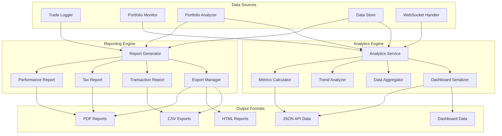

# Task 9 Handoff: Build Reporting and Analytics System

## Overview
Task 9 focuses on building a comprehensive reporting and analytics system that provides detailed portfolio performance reports, tax summaries, and real-time dashboard data. This system will leverage the monitoring and alerting infrastructure from Task 8 to deliver actionable insights and comprehensive analytics for portfolio management.

## Completed Foundation (Task 8)
The monitoring and alerting system has been successfully implemented, providing:

### Real-time Portfolio Monitoring
- **PortfolioMonitor**: Real-time position tracking and market analysis
- **Alert Generation**: Multi-severity alert system (INFO, WARNING, CRITICAL)
- **Market Analysis**: Price movement detection, volatility analysis, and trend monitoring
- **Configurable Thresholds**: Position change, portfolio change, and risk limit monitoring

### Multi-channel Notification System
- **NotificationService**: Priority-based message routing and delivery confirmation
- **Email Provider**: SMTP support with HTML formatting and authentication
- **SMS Provider**: Twilio and AWS SNS integration with international support
- **Webhook Provider**: HTTP POST delivery with Slack/Discord formatting
- **Throttling & Retry**: Rate limiting, automatic retries, and delivery tracking

### Integration Points Available
- **Real-time Data Streams**: WebSocket integration for live market data
- **Portfolio Analysis**: Integration with PortfolioAnalyzer for performance metrics
- **Risk Management**: Integration with RiskManager for risk assessments
- **Technical Analysis**: Integration with TechnicalAnalysis for market indicators
- **Trade Logging**: Comprehensive transaction history and audit trails

## Task 9 Requirements

### 9.1 Performance Reporting Engine
- **Requirement 7.2**: Generate comprehensive portfolio performance reports
- **Requirement 7.3**: Create tax summary reports and transaction history exports

### 9.2 Analytics Dashboard Data Preparation
- **Requirement 3.4**: Provide real-time metrics for dashboard consumption
- **Requirement 8.1**: Integrate with monitoring system for live analytics

## Implementation Plan

### Subtask 9.1: Implement Performance Reporting Engine
**Files to Create:**
- `financial_portfolio_automation/reporting/report_generator.py`
- `financial_portfolio_automation/reporting/performance_report.py`
- `financial_portfolio_automation/reporting/tax_report.py`
- `financial_portfolio_automation/reporting/transaction_report.py`
- `financial_portfolio_automation/reporting/export_manager.py`
- `financial_portfolio_automation/reporting/__init__.py`
- `tests/test_report_generator.py`
- `tests/test_performance_report.py`
- `tests/test_tax_report.py`
- `tests/test_transaction_report.py`
- `tests/integration/test_reporting_integration.py`

**Key Components:**
1. **ReportGenerator Class**
   - Unified interface for all report types
   - Template-based report generation
   - Multi-format output support (PDF, HTML, CSV, JSON)
   - Scheduled report generation capabilities

2. **Performance Report System**
   - Portfolio performance metrics (returns, volatility, Sharpe ratio)
   - Benchmark comparison and relative performance
   - Asset allocation analysis and drift monitoring
   - Risk-adjusted performance metrics
   - Drawdown analysis and recovery periods

3. **Tax Reporting System**
   - Realized gains/losses calculation
   - Tax lot tracking and FIFO/LIFO accounting
   - Wash sale rule detection and adjustment
   - Form 8949 and Schedule D preparation
   - Tax-loss harvesting opportunities identification

4. **Transaction History Reports**
   - Comprehensive trade history with execution details
   - Commission and fee analysis
   - Order fill analysis and execution quality
   - Strategy performance attribution
   - Compliance and audit trail reports

5. **Export Management**
   - Multiple format support (CSV, JSON, Excel, PDF)
   - Data sanitization and privacy controls
   - Batch export capabilities
   - Automated report delivery via email/webhook

### Subtask 9.2: Implement Analytics Dashboard Data Preparation
**Files to Create:**
- `financial_portfolio_automation/analytics/analytics_service.py`
- `financial_portfolio_automation/analytics/metrics_calculator.py`
- `financial_portfolio_automation/analytics/trend_analyzer.py`
- `financial_portfolio_automation/analytics/data_aggregator.py`
- `financial_portfolio_automation/analytics/dashboard_serializer.py`
- `financial_portfolio_automation/analytics/__init__.py`
- `tests/test_analytics_service.py`
- `tests/test_metrics_calculator.py`
- `tests/test_trend_analyzer.py`
- `tests/test_data_aggregator.py`
- `tests/integration/test_analytics_integration.py`

**Key Components:**
1. **AnalyticsService Class**
   - Real-time metrics calculation and caching
   - Historical data aggregation and trend analysis
   - Performance benchmarking and comparison
   - Risk metrics monitoring and alerting integration

2. **Metrics Calculator**
   - Portfolio value and allocation metrics
   - Performance metrics (returns, volatility, ratios)
   - Risk metrics (VaR, beta, correlation)
   - Technical indicators and market sentiment

3. **Trend Analyzer**
   - Historical performance trend analysis
   - Seasonal pattern detection
   - Correlation analysis with market indices
   - Volatility regime identification

4. **Data Aggregator**
   - Multi-timeframe data aggregation (daily, weekly, monthly)
   - Rolling window calculations
   - Benchmark data integration
   - Market sector performance comparison

5. **Dashboard Serializer**
   - JSON/REST API data formatting
   - Real-time data streaming preparation
   - Chart data optimization
   - Mobile-friendly data structures

## Integration Points

### With Existing Systems
1. **Portfolio Monitor Integration**
   - Real-time alert data for dashboard widgets
   - Performance threshold monitoring
   - Risk limit breach notifications
   - Market volatility impact analysis

2. **Trade Logger Integration**
   - Transaction history for performance attribution
   - Execution quality analysis
   - Commission and fee tracking
   - Audit trail for compliance reports

3. **Portfolio Analyzer Integration**
   - Performance metrics calculation
   - Risk-adjusted returns analysis
   - Asset allocation optimization insights
   - Benchmark comparison data

4. **Risk Manager Integration**
   - Risk metrics for dashboard display
   - Stress testing results
   - Scenario analysis outcomes
   - Risk budget utilization tracking

### Data Sources
1. **Historical Data**
   - Trade execution history from TradeLogger
   - Position history from DataStore
   - Market data from MarketDataClient
   - Performance snapshots from PortfolioAnalyzer

2. **Real-time Data**
   - Live portfolio values from PortfolioMonitor
   - Current positions from AlpacaClient
   - Market data from WebSocketHandler
   - Alert status from NotificationService

## Technical Considerations

### Performance and Scalability
- Efficient data aggregation with caching strategies
- Incremental report generation for large datasets
- Background processing for resource-intensive calculations
- Memory-efficient data structures for historical analysis

### Data Quality and Accuracy
- Data validation and consistency checks
- Reconciliation with broker statements
- Error handling for missing or corrupted data
- Audit trails for all calculations and adjustments

### Security and Compliance
- Sensitive data encryption and access controls
- PII protection in exported reports
- Audit logging for report generation and access
- Compliance with financial reporting standards

### Extensibility
- Plugin architecture for custom report types
- Template system for report customization
- API endpoints for third-party integrations
- Configurable metrics and calculations

## Testing Strategy

### Unit Testing
- Individual report generator components
- Calculation accuracy with known datasets
- Data export format validation
- Error handling and edge cases

### Integration Testing
- End-to-end report generation workflows
- Real-time analytics data pipeline
- Dashboard data serialization accuracy
- Performance under load conditions

### Data Validation
- Historical data accuracy verification
- Tax calculation compliance testing
- Performance metric validation against benchmarks
- Report output format verification

## Dependencies and Prerequisites

### Internal Dependencies
- **Task 8**: Monitoring and alerting system (completed)
- **Task 7**: Trade logging and execution system
- **Task 5**: Portfolio and technical analysis engines
- **Task 4**: Data management and storage layer
- **Task 3**: Market data and API integration

### External Dependencies
- PDF generation library (ReportLab or WeasyPrint)
- Excel export library (openpyxl or xlsxwriter)
- Chart generation library (matplotlib or plotly)
- Template engine (Jinja2 for HTML reports)

### Configuration Requirements
- Report templates and styling configurations
- Tax jurisdiction settings and rules
- Benchmark data sources and mappings
- Dashboard refresh intervals and caching policies

## Success Criteria

### Functional Requirements
- Comprehensive portfolio performance reports
- Accurate tax reporting with regulatory compliance
- Real-time dashboard data with sub-second latency
- Multi-format export capabilities

### Performance Requirements
- Report generation within 30 seconds for 1-year history
- Dashboard data updates within 1 second of market changes
- Support for 10+ concurrent report generations
- Efficient memory usage for large datasets

### Quality Requirements
- 100% calculation accuracy for tax and performance metrics
- Comprehensive error handling and graceful degradation
- Audit trails for all report generation activities
- Configurable report templates and customization

## Next Steps After Task 9

Task 9 completion will enable:
- **Task 10**: MCP tool integration with comprehensive reporting and analytics tools
- **Task 11**: CLI and API endpoints for report generation and analytics access
- **Task 12**: End-to-end system validation with complete reporting capabilities

The reporting and analytics system will provide the foundation for comprehensive portfolio oversight, regulatory compliance, and data-driven decision making, completing the core analytical capabilities of the portfolio automation framework.

## Data Flow Architecture

This architecture ensures efficient data flow from multiple sources through the reporting and analytics engines to various output formats, supporting both batch reporting and real-time analytics requirements.