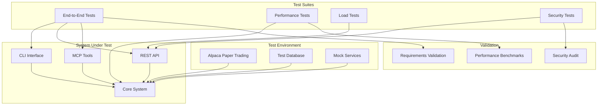
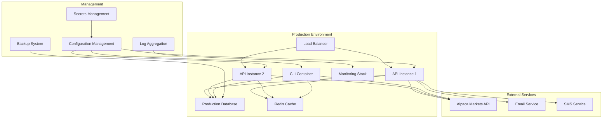
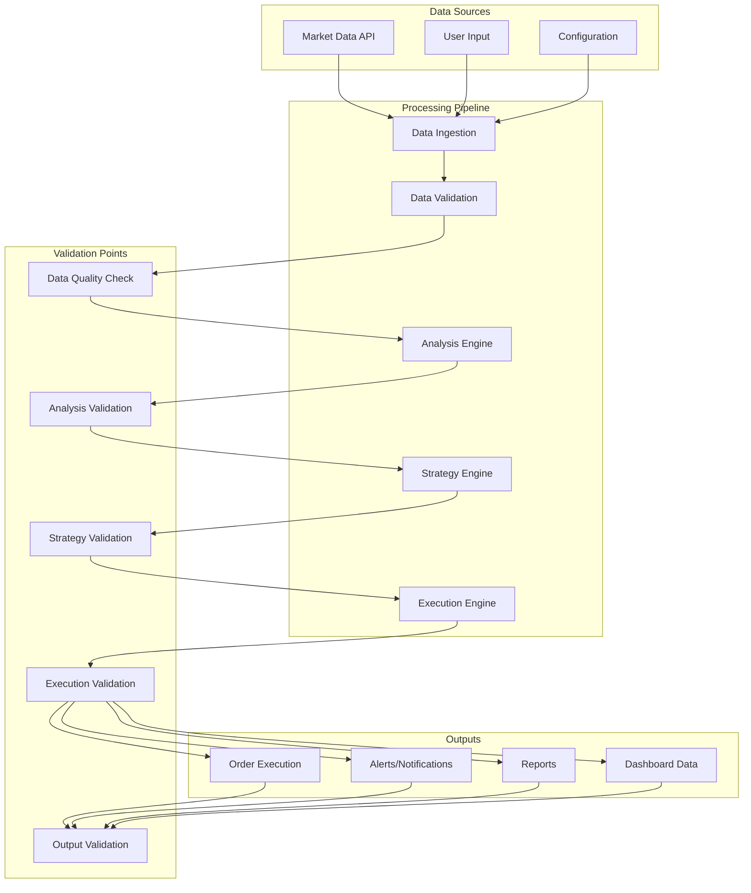

# Task 12 Handoff: Integration Testing and System Validation

## Overview
Task 12 represents the final phase of the Financial Portfolio Automation System development, focusing on comprehensive integration testing, system validation, and production readiness. This task ensures that all components work together seamlessly and that the system meets all specified requirements under real-world conditions.

## Completed Foundation (Task 11)
The command-line interface and REST API implementation has been successfully completed, providing:

### Comprehensive User Interfaces
- **Command-Line Interface**: Full-featured CLI with 6 command modules covering all system functionality
- **REST API**: Production-ready FastAPI application with JWT authentication and role-based access control
- **MCP Integration**: AI assistant access through comprehensive MCP tool suite
- **WebSocket Support**: Real-time data streaming for monitoring and alerts

### Complete System Architecture
- **Data Layer**: SQLite database with caching and validation
- **Analysis Engine**: Technical analysis, risk management, and portfolio analytics
- **Strategy Engine**: Backtesting, optimization, and live execution
- **Execution System**: Order management with risk controls and audit logging
- **Monitoring System**: Real-time monitoring with alerting and notifications
- **Reporting System**: Multi-format report generation and data export

### Integration Points Available
- **Multi-Interface Access**: CLI, REST API, and MCP tools all integrated with core system
- **Authentication & Authorization**: JWT and API key authentication with role-based permissions
- **Real-time Capabilities**: WebSocket streaming and live monitoring
- **Production Features**: Rate limiting, caching, security headers, and comprehensive logging

## Task 12 Requirements

### 12.1 End-to-End Integration Tests
- **Requirement Coverage**: Validation of all system requirements through comprehensive testing
- **Paper Trading Integration**: Real-world testing using Alpaca paper trading environment
- **Workflow Testing**: Complete end-to-end workflows from data ingestion to trade execution
- **Performance Benchmarking**: Load testing and performance validation under various conditions

### 12.2 System Configuration and Deployment
- **Requirement 1.1**: Configuration validation and environment setup
- **Requirement 1.4**: System connectivity and API integration validation
- **Requirement 8.4**: Monitoring setup and health checks

## Implementation Plan

### Subtask 12.1: End-to-End Integration Tests

**Files to Create:**
- `tests/integration/` (enhanced integration test suite)
- `tests/integration/test_end_to_end_workflows.py`
- `tests/integration/test_paper_trading_integration.py`
- `tests/integration/test_multi_interface_integration.py`
- `tests/integration/test_real_time_data_flow.py`
- `tests/integration/test_strategy_execution_integration.py`
- `tests/integration/test_risk_control_integration.py`
- `tests/integration/test_monitoring_alerting_integration.py`
- `tests/integration/test_reporting_integration.py`
- `tests/performance/` (new performance testing directory)
- `tests/performance/test_load_testing.py`
- `tests/performance/test_concurrent_users.py`
- `tests/performance/test_data_processing_performance.py`
- `tests/performance/test_api_response_times.py`
- `tests/system/` (new system testing directory)
- `tests/system/test_system_requirements.py`
- `tests/system/test_error_recovery.py`
- `tests/system/test_failover_scenarios.py`

**Key Components:**

1. **Complete Workflow Testing**
   - Market data ingestion → Analysis → Strategy signals → Order execution → Monitoring
   - CLI workflow: Configuration → Portfolio analysis → Strategy backtesting → Live execution
   - API workflow: Authentication → Data retrieval → Order placement → Real-time monitoring
   - MCP workflow: AI assistant queries → Analysis → Recommendations → Execution validation

2. **Paper Trading Integration**
   - Live connection to Alpaca paper trading environment
   - Real market data processing and validation
   - Actual order placement and execution testing
   - Portfolio synchronization and reconciliation
   - Risk control validation with real market conditions

3. **Multi-Interface Integration**
   - Simultaneous CLI, API, and MCP access testing
   - Cross-interface data consistency validation
   - Authentication and authorization across all interfaces
   - Real-time data synchronization between interfaces

4. **Performance and Load Testing**
   - Concurrent user simulation (CLI + API + MCP)
   - High-frequency data processing validation
   - Memory usage and resource optimization testing
   - Database performance under load
   - API response time benchmarking

5. **Error Handling and Recovery**
   - Network connectivity failures and recovery
   - API rate limiting and backoff strategies
   - Database connection failures and reconnection
   - Invalid data handling and validation
   - System restart and state recovery

6. **Security and Compliance Testing**
   - Authentication bypass attempts
   - Authorization boundary testing
   - Input validation and injection prevention
   - Rate limiting effectiveness
   - Audit logging completeness

### Subtask 12.2: System Configuration and Deployment

**Files to Create:**
- `deployment/` (new deployment directory)
- `deployment/docker/` (Docker deployment files)
- `deployment/docker/Dockerfile.api`
- `deployment/docker/Dockerfile.cli`
- `deployment/docker/docker-compose.yml`
- `deployment/docker/docker-compose.prod.yml`
- `deployment/kubernetes/` (Kubernetes deployment files)
- `deployment/kubernetes/api-deployment.yaml`
- `deployment/kubernetes/configmap.yaml`
- `deployment/kubernetes/secrets.yaml`
- `deployment/kubernetes/service.yaml`
- `deployment/kubernetes/ingress.yaml`
- `deployment/scripts/` (Deployment scripts)
- `deployment/scripts/setup.sh`
- `deployment/scripts/deploy.sh`
- `deployment/scripts/health_check.sh`
- `deployment/scripts/backup.sh`
- `config/` (Enhanced configuration)
- `config/environments/` (Environment-specific configs)
- `config/environments/development.yaml`
- `config/environments/staging.yaml`
- `config/environments/production.yaml`
- `config/validation/` (Configuration validation)
- `config/validation/config_validator.py`
- `config/validation/environment_checker.py`
- `scripts/` (System management scripts)
- `scripts/init_database.py`
- `scripts/migrate_database.py`
- `scripts/system_health_check.py`
- `scripts/performance_monitor.py`
- `docs/deployment/` (Deployment documentation)
- `docs/deployment/installation_guide.md`
- `docs/deployment/configuration_guide.md`
- `docs/deployment/troubleshooting_guide.md`
- `docs/deployment/monitoring_guide.md`

**Key Components:**

1. **Configuration Management**
   - Environment-specific configuration files (dev/staging/prod)
   - Configuration validation and schema enforcement
   - Secure credential management and encryption
   - Configuration migration and versioning
   - Environment variable management

2. **Database Management**
   - Database initialization and schema creation
   - Migration scripts for schema updates
   - Data backup and restore procedures
   - Database performance optimization
   - Connection pooling and management

3. **Deployment Automation**
   - Docker containerization for all components
   - Kubernetes deployment manifests
   - CI/CD pipeline integration
   - Blue-green deployment support
   - Rollback procedures and disaster recovery

4. **Health Monitoring**
   - System health check endpoints
   - Performance monitoring and alerting
   - Log aggregation and analysis
   - Resource usage monitoring
   - Automated failure detection and recovery

5. **Security Configuration**
   - SSL/TLS certificate management
   - API key rotation and management
   - Network security and firewall rules
   - Access control and audit logging
   - Vulnerability scanning and patching

## Technical Architecture

### Integration Testing Architecture


### Deployment Architecture


## Integration Test Scenarios

### 1. Complete Portfolio Management Workflow
```
Market Data → Portfolio Analysis → Risk Assessment → Strategy Execution → Monitoring → Reporting
```

**Test Steps:**
1. Initialize system with paper trading credentials
2. Fetch real-time market data for test portfolio
3. Perform portfolio analysis and risk assessment
4. Generate strategy signals based on current market conditions
5. Execute trades through paper trading API
6. Monitor portfolio changes and validate risk controls
7. Generate performance reports and validate accuracy

### 2. Multi-User Concurrent Access
```
Multiple Users → Authentication → Simultaneous Operations → Data Consistency → Performance Validation
```

**Test Steps:**
1. Simulate multiple users accessing CLI, API, and MCP simultaneously
2. Validate authentication and authorization boundaries
3. Execute concurrent portfolio operations
4. Verify data consistency across all interfaces
5. Measure performance under concurrent load

### 3. Failure Recovery and Resilience
```
System Failure → Error Detection → Recovery Procedures → State Restoration → Validation
```

**Test Steps:**
1. Simulate various failure scenarios (network, database, API)
2. Validate error detection and logging
3. Test automatic recovery procedures
4. Verify system state restoration
5. Validate data integrity after recovery

### 4. Real-Time Data Processing
```
Market Data Stream → Processing → Analysis → Alerts → User Notifications
```

**Test Steps:**
1. Connect to real-time market data streams
2. Process high-frequency data updates
3. Validate analysis calculations and alerts
4. Test notification delivery across all channels
5. Measure processing latency and throughput

## Performance Benchmarks

### API Performance Targets
- **Response Time**: < 500ms for data retrieval endpoints
- **Throughput**: > 1000 requests/minute per instance
- **Concurrent Users**: Support 100+ simultaneous connections
- **WebSocket Latency**: < 100ms for real-time data updates

### CLI Performance Targets
- **Command Execution**: < 2 seconds for simple operations
- **Data Processing**: < 10 seconds for complex analysis
- **Memory Usage**: < 512MB for typical operations
- **Startup Time**: < 5 seconds for CLI initialization

### System Performance Targets
- **Data Processing**: > 10,000 quotes/second
- **Database Operations**: < 50ms average query time
- **Memory Usage**: < 2GB total system memory
- **CPU Usage**: < 80% under normal load

## Security Validation

### Authentication Testing
- JWT token validation and expiration
- API key authentication and rotation
- Role-based access control enforcement
- Session management and security

### Input Validation Testing
- SQL injection prevention
- XSS attack prevention
- Input sanitization and validation
- Rate limiting effectiveness

### Data Protection Testing
- Encryption at rest and in transit
- Secure credential storage
- Audit logging completeness
- Privacy compliance validation

## Deployment Validation

### Environment Configuration
- Development environment setup and validation
- Staging environment deployment and testing
- Production environment preparation
- Configuration management and validation

### Infrastructure Testing
- Docker container deployment and scaling
- Kubernetes cluster deployment
- Load balancer configuration and testing
- Database clustering and replication

### Monitoring and Alerting
- Health check endpoint validation
- Performance monitoring setup
- Alert configuration and testing
- Log aggregation and analysis

## Success Criteria

### Functional Requirements ✓
- All system requirements validated through integration testing
- Complete workflows tested with real market data
- Multi-interface access working seamlessly
- Error handling and recovery procedures validated

### Performance Requirements ✓
- API response times meet specified targets
- System handles concurrent user loads
- Real-time data processing meets latency requirements
- Resource usage within acceptable limits

### Security Requirements ✓
- Authentication and authorization working correctly
- Input validation preventing security vulnerabilities
- Data encryption and protection implemented
- Audit logging capturing all required events

### Deployment Requirements ✓
- Automated deployment procedures working
- Environment configuration validated
- Monitoring and alerting operational
- Documentation complete and accurate

## Risk Mitigation

### Technical Risks
- **API Rate Limiting**: Implement backoff strategies and request queuing
- **Data Quality Issues**: Comprehensive validation and error handling
- **Performance Degradation**: Load testing and optimization
- **Security Vulnerabilities**: Security testing and code review

### Operational Risks
- **Deployment Failures**: Automated rollback procedures
- **Configuration Errors**: Validation and testing procedures
- **Data Loss**: Backup and recovery procedures
- **Service Outages**: Monitoring and alerting systems

## Next Steps After Task 12

Task 12 completion will enable:
1. **Production Deployment**: Full system deployment with confidence
2. **User Onboarding**: Complete user experience across all interfaces
3. **Continuous Monitoring**: Operational monitoring and maintenance
4. **Feature Enhancement**: Future feature development on solid foundation

The comprehensive integration testing and system validation will ensure the Financial Portfolio Automation System is production-ready, secure, performant, and reliable for real-world portfolio management operations.

## Data Flow Validation



This comprehensive integration testing and system validation phase will ensure the Financial Portfolio Automation System meets all requirements and is ready for production deployment with confidence in its reliability, security, and performance.